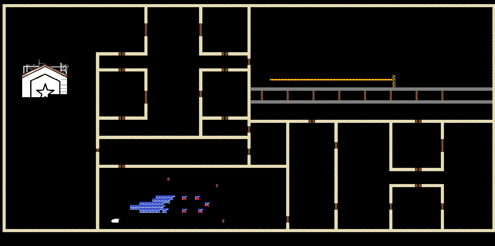

# CYBERJITSU


Libraries installed - commands used
```
sudo apt install cabal-install
cabal update
cabal install cabal-install
cabal install random
cabal install gloss
cabal install gloss-juicy
```

=================
<!--ts-->
   ## [About](#About)
   * This is a software that I'm building named CYBERJITSU.
   * This project idea is based on my favourite movie "Shiki-Jitsu(式日)"-2000 by Hideaki Anno.
   * Some graphics that appear in this game were created based on the movie that took place in Ube-Yamaguchi,Japan.
      
## Installation 
### Download
```
git clone https://github.com/joaocasr/cyberJitsu
```

    
## Estado atual do Mapa
  

<!--te-->
